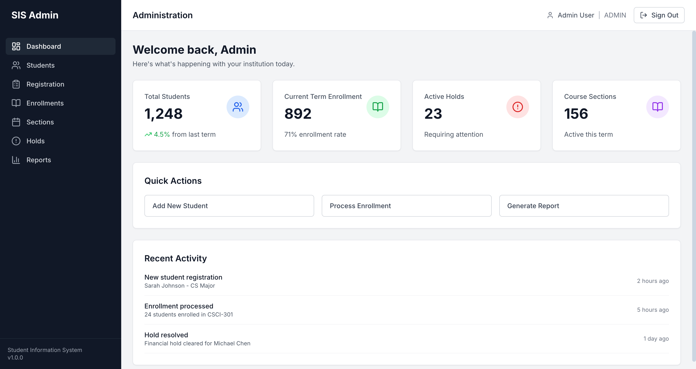
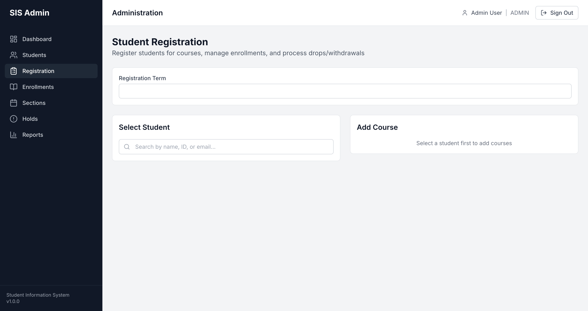
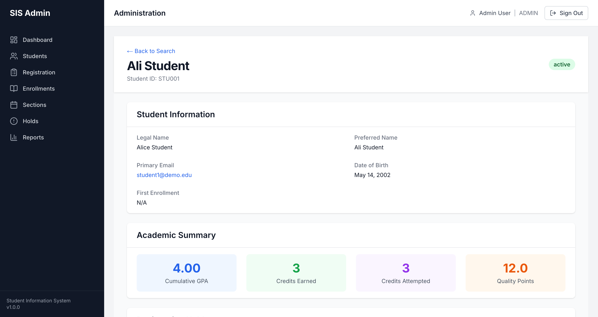
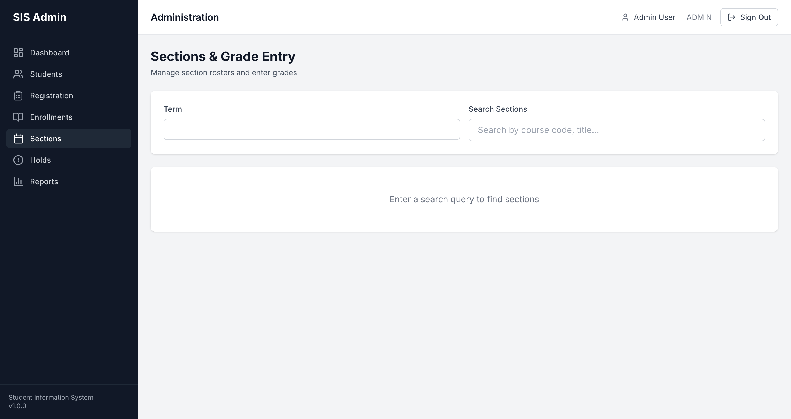

# Student Information System (SIS)

A modern, self-hostable Student Information System for higher education institutions (100-10,000 students).

## Screenshots

### Admin Dashboard


### Student Registration


### Student Detail View


### Registration Holds


### Sections & Grade Entry


## Tech Stack

- **Frontend**: Next.js 15 (App Router) + React + TailwindCSS
- **API**: tRPC v11 (end-to-end type safety)
- **ORM**: Drizzle ORM (SQL-first, excellent TypeScript inference)
- **Database**: PostgreSQL 16
- **Cache/Queue**: Redis 7 + BullMQ
- **Storage**: MinIO (S3-compatible)
- **Auth**: NextAuth.js v5 (SAML/OIDC federation)

## Features

### Admin Portal
- **Student Search** - Find students by name, ID, or email
- **Registration Management** - Enroll, drop, withdraw, override enrollments
- **Holds Management** - Create, view, and release registration holds
- **Grade Entry** - Section search with batch grade submission
- **Student Detail View** - Academic summary, GPA, enrollment history by term

### Student Portal (In Progress)
- Course schedule view
- Grades view
- Registration self-service

## Getting Started

### Prerequisites
- Node.js 20+
- pnpm 9+
- Docker (for PostgreSQL, Redis, MinIO)

### Installation

```bash
# Install dependencies
pnpm install

# Start Docker services
docker compose -f docker/docker-compose.yml up -d

# Run database migrations
pnpm db:migrate

# Seed demo data
pnpm --filter @sis/db db:seed

# Start development server
pnpm dev
```

### Demo Accounts

After seeding, these accounts are available:

| Email | Password | Role |
|-------|----------|------|
| admin@demo.edu | admin123 | Administrator |
| registrar@demo.edu | registrar123 | Registrar |
| advisor@demo.edu | advisor123 | Advisor |
| student1@demo.edu | student123 | Student (Alice) |
| student2@demo.edu | student123 | Student (Bob) |

## Project Structure

```
student-information-system/
├── apps/
│   └── web/                    # Next.js 15 application
│       └── src/
│           ├── app/            # App Router pages
│           ├── components/     # React components
│           └── trpc/           # tRPC client
├── packages/
│   ├── api/                    # tRPC routers
│   ├── db/                     # Drizzle ORM schemas
│   └── domain/                 # Pure business logic (GPA, SAP, R2T4)
└── docker/                     # Docker Compose configuration
```

## Compliance

Designed with compliance in mind for:
- **FERPA** - Student privacy and access logging
- **Title IV** - Federal financial aid regulations
- **IRS 1098-T** - Tax reporting
- **WCAG 2.1 AA** - Digital accessibility

## License

This project is licensed under the GNU General Public License v3.0 - see the [LICENSE](LICENSE) file for details.
